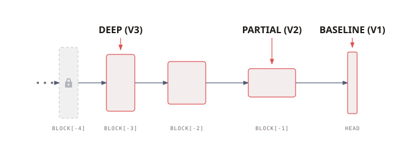
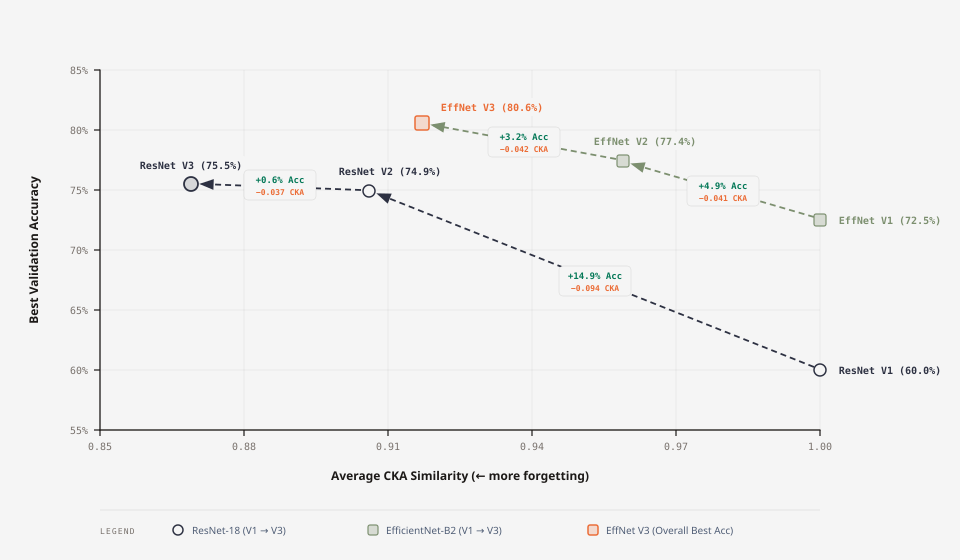
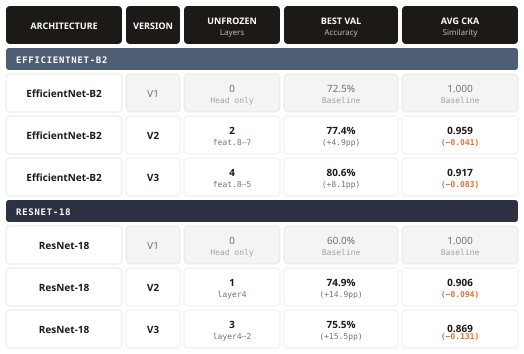
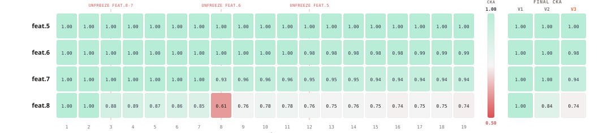
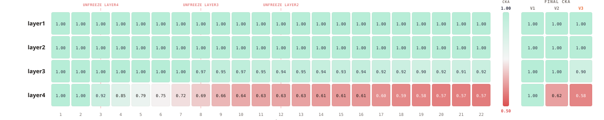
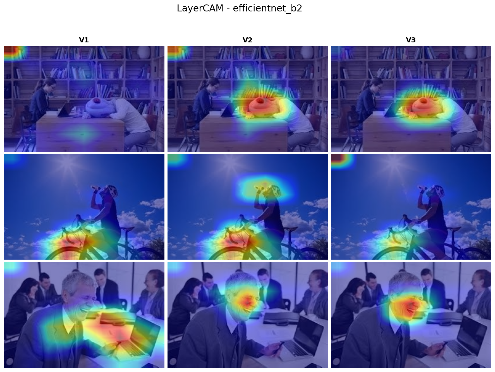
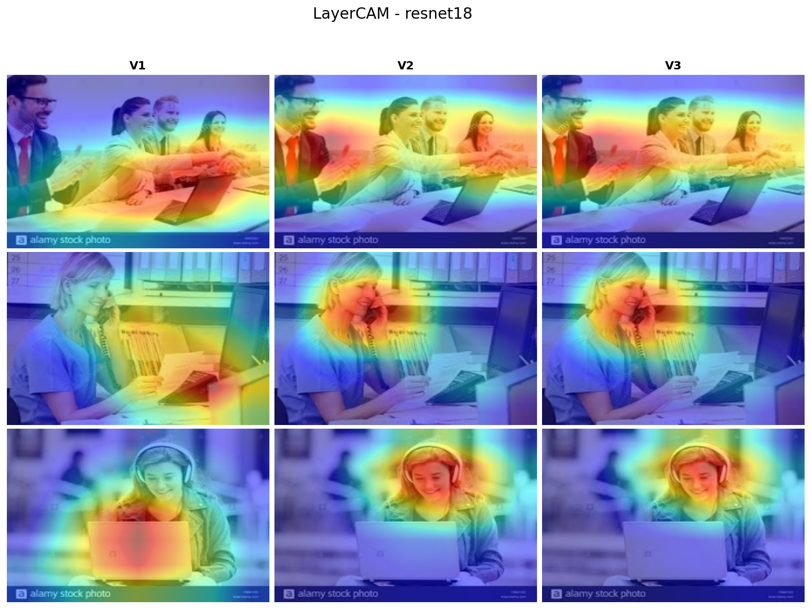

# Trained to Forget

Exploring the trade-off between learning a new task and forgetting old features during CNN fine-tuning. By progressively unfreezing layers in ResNet-18 and EfficientNet-B2 during fine-tuning on Human Action Recognition, this research analyzes the resulting trade-offs using Centered Kernel Alignment (CKA) and LayerCAM.

## Research Hypotheses

Our evaluation tests two core hypotheses:

- **H1 (The Forgetting Trade-off):** Increasing the number of unfrozen layers during fine-tuning accelerates catastrophic forgetting of the original pre-trained representations.
- **H2 (Spatial Interpretability):** Extensive fine-tuning forces intermediate feature representations to specialize, resulting in spatial attention heatmaps that focus on whole, semantic objects rather than diffuse background context.

## Methodology

We employ a systematic unfreezing approach using ResNet-18 and EfficientNet-B2 to stabilize training dynamics and evaluate progressive fine-tuning depths.

  

- **V1 (Baseline):** Only the custom 2-stage MLP classifier head is trained; the entire backbone remains strictly frozen.
- **V2 (Partial Fine-tuning):** The classifier head is trained from epoch 1, and the deepest convolutional block is unfrozen at epoch 3.
- **V3 (Deep Fine-tuning):** The deepest block is unfrozen at epoch 3, the next deepest block is unfrozen at epoch 8, and an additional block is unfrozen at epoch 12.
- **Learning Rate Management:** Newly unfrozen deeper layers receive exponentially decayed learning rates. Whenever a new block is unfrozen, the base learning rate decays and the optimizer is re-initialized with a one-epoch warmup.

## The Forgetting vs. Performance Trade-off

Fine-tuning depth introduces a measurable trade-off. Improving target task accuracy requires sacrificing upstream representation fidelity.

  

EfficientNet-B2 scales effectively across different fine-tuning depths while preserving a high average CKA score, demonstrating robust retention of pre-trained representations.

  

ResNet-18 exhibits diminishing returns. Advancing from V2 to V3 yields a marginal downstream accuracy improvement but causes significant representational degradation. Unfreezing beyond the final block in standard residual networks degrades general features without meaningful target gains.

## Quantifying Representational Drift (CKA)

Linear Centered Kernel Alignment (CKA) measures the representational similarity between intermediate feature activations of fine-tuned models and their original pre-trained reference. Lower CKA scores indicate greater catastrophic forgetting.

  

For EfficientNet-B2, early blocks remain largely invariant. The deepest block decays steadily as it absorbs task-specific representations. A distinct similarity drop occurs at epoch 8, caused by the one-epoch learning rate warmup applied immediately after unfreezing the new layer block.

  

ResNet-18 demonstrates strict hierarchical freezing. Earlier layers exhibit zero drift, while the deepest layers experience severe representational collapse during joint fine-tuning in V3.

## Spatial Interpretability (LayerCAM)

LayerCAM visualizes spatial attention heatmaps to assess whether deeper fine-tuning focuses attention more tightly onto relevant actors and objects.

  
  

The heatmaps validate our second hypothesis. In the V1 baseline, the network attends to diffuse textural patches. As we progress to V2 and V3, spatial activation maps contract sharply to enclose the full semantic action. Deeper unfreezing forces intermediate layers to construct object-level semantic segmentations rather than relying on generic context.

## Replication

All experiments can be reproduced end-to-end via our self-contained Kaggle notebook.

[Launch Experiments on Kaggle](https://www.kaggle.com/)
